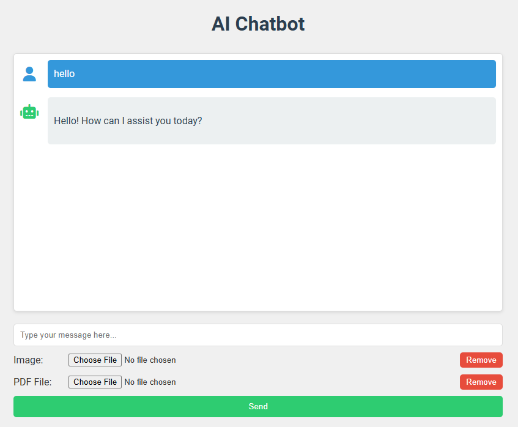
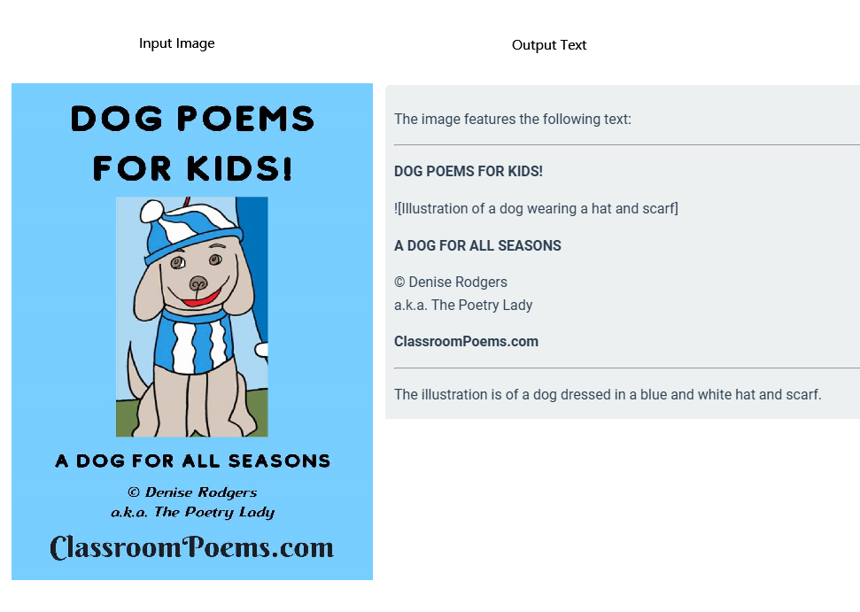
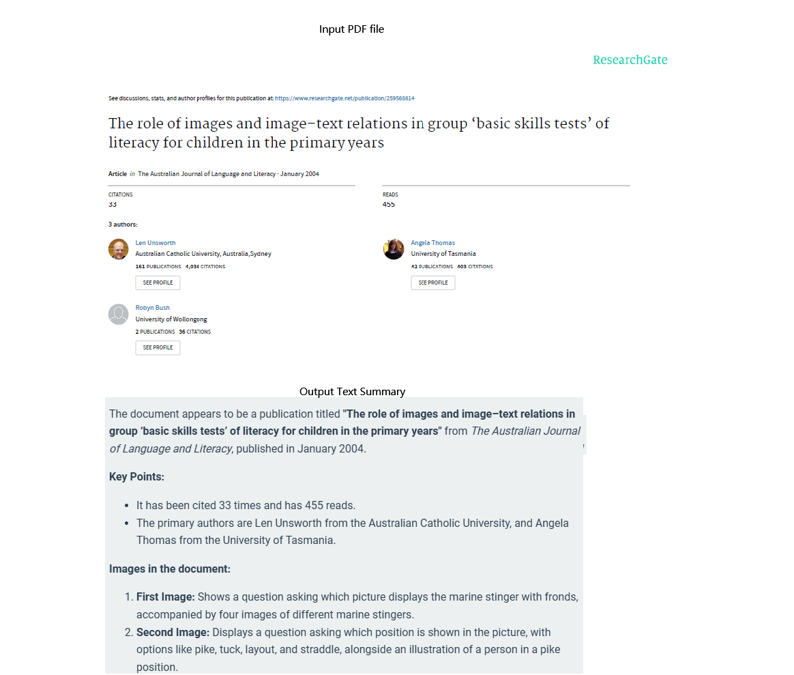

# A chatbot using images and PDF files as context
This chatbot was built with Flask and LangChain. The users can interact with large language models such as OpenAI models using text, images and PDF files as context.

## Features

- Web-based interface for easy interaction
- Persistent chat history for contextual conversations
- Support for text input and conversation history
- Image upload capability for visual context
- PDF document upload and parsing
- Use PDF file (text and images) as context
- Secure login system to protect the chatbot
- Integration with OpenAI's GPT models via LangChain
- Streaming responses for a more dynamic user experience
- Structured markdown output for organized and formatted responses
- Support for generating tables, lists, and code blocks in AI responses
- Enhanced readability with automatic formatting of complex information


## Technologies Used

- Flask: A lightweight WSGI web application framework in Python
- LangChain: A framework for developing applications powered by language models
- OpenAI API: For accessing advanced language models
- PyMuPDF: For parsing and extracting content from PDF files
- Werkzeug: For secure file uploads and password hashing


## Web UI Examples

Here are some screenshots of the chatbot's web interface:


### Chat Interface


### Upload image as context


### Upload PDF file as context


These screenshots provide a visual guide to the user interface and key features of the chatbot.


## Setup and Installation

1. Clone the repository
2. Install the required dependencies:
   ```
   pip install -r requirements.txt
   ```
3. Set up your environment variables in a `.env` file:
   ```
   OPENAI_API_KEY=your_openai_api_key_here
   ```
4. Run the Flask application:
   ```
   python chatbot.py
   ```

## Usage

1. Access the application through your web browser
2. Log in using the predefined password (Gary2024)
3. Start chatting with the AI assistant
4. Upload images or PDF files for additional context in your conversations


## Security Note

This application uses a simple password-based authentication system. For production use, it's recommended to implement a more robust authentication mechanism.

## Contributing

Contributions to improve the chatbot are welcome. Please feel free to submit pull requests or open issues for bugs and feature requests.

## License

This project is open-source and available under the GNU Affero General Public License.

